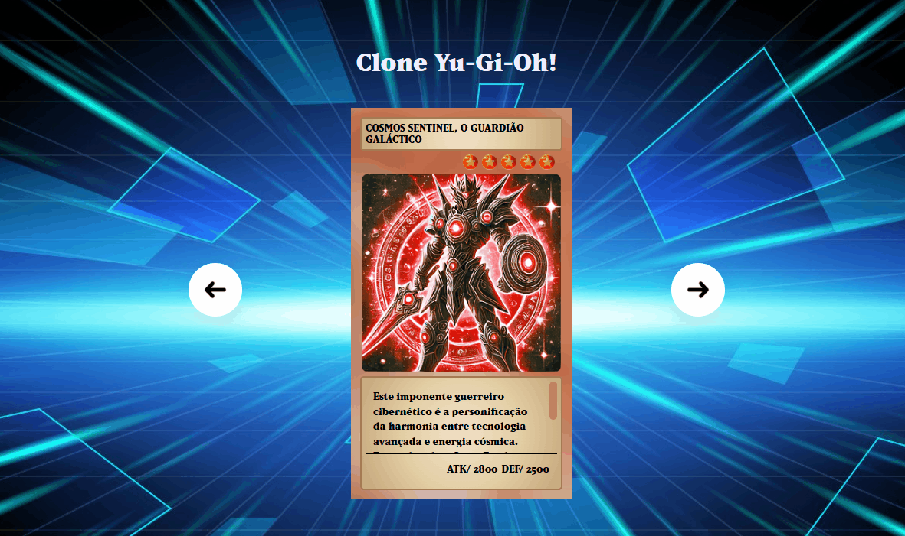

# Esse é o meu primeiro projeto
Tem como inspiração o anime Yu-Gi-Oh!🧙

[]

## Tecnologias utilizadas :

- html

- css

- Java script

## Como utilizar?

- Você pode olhar as descrições completas das cartas usando o scrol do mouse

- Clicando na carta você colocará a carta virada para baixo em posição de defesa

- Clicando nas seta de avançar você irá para a proxima carta, e clicando na seta de voltar irá voltar para a carta anterior  

